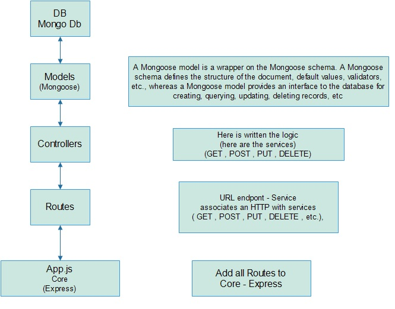
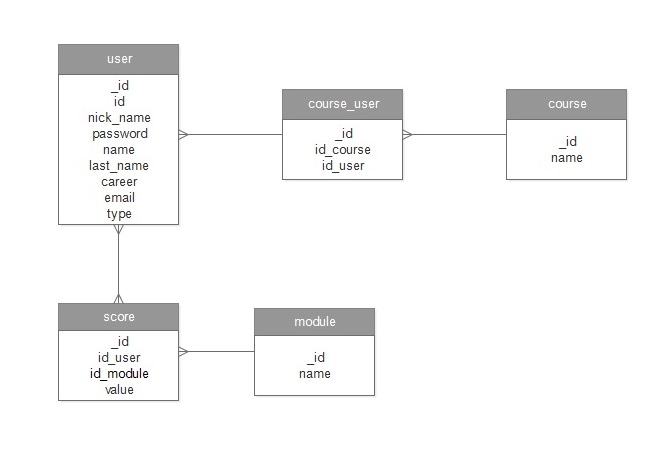

# Education App

This API performs POST, GET, PUT and DELETE.
This API can deploy with docker container.
This API we used the JavaScript, express and mongoDB

## Prerequisites 🚀

1. Install Windows 10
2. Install Node.js version 8.9.4.
3. Install docker.
4. Install docker mongo:4.1

## Installation 🔧

1. Clone Repository
2. Install Dependencies: npm install
3. Configure config.js with app host:port
4. Configure config.js with docker host:port
5. start docker container: docker run -d --name mongodb -p 27017:27017 mongo:4.1
6. enter to containe: docker exec -it mongodb bash
7. enter mongo shell: mongo
8. execute all queries in : sql folder.
9. Optional: deploy app in docker: you should execute: /docker_bin/run-create-image.bat
10. Optional: then you should execute: /docker_bin/run-create-image.bat

## Documentation

### Diagram-architecture



### Diagram-entity-relation



## Usage (Execute) ⚙️

1. npm start

### USERS

```
GET USERS
{Host}:{Port}/api/v1/users
{Host}:{Port}/api/v1/users/{user_id}
http://localhost:3001/api/v1/users
http://localhost:3001/api/v1/users/{user_id}
{
    "users": [
        {
            "_id": 9928025,
            "nick_name": "rseveric",
            "password": "pass123",
            "name": "Richard",
            "last_name": "Severich",
            "career": "Systems engineer",
            "email": "richard.severich@gmail.com",
            "type": "Engineer"
        }
}

POST USERS
{Host}:{Port}/api/v1/users
http://localhost:3001/api/v1/users
BODY:
{
    "_id": 45215856,
    "nick_name": "helmer",
    "password": "pass123",
    "name": "Elmer",
    "last_name": "Hermosa",
    "career": "Systems enginee",
    "email": "Elmer.Hermosa@gmail.com",
    "type": "Trainer"
}

PUT USERS
{Host}:{Port}/api/v1/users/{user_id}
http://localhost:3001/api/v1/users/45215856
BODY:
{
    "nick_name": "hermosa",
    "password": "pass555",
    "name": "Elmer",
    "last_name": "Hermosa",
    "career": "Electronic enginee",
    "email": "Elmer.Hermosa@gmail.com",
    "type": "Trainer"
}

DELETE USERS
{Host}:{Port}/api/v1/users/{user_id}
http://localhost:3001/api/v1/users/45215856
```

### COURSES

```
GET COURSES
{Host}:{Port}/api/v1/courses
{Host}:{Port}/api/v1/courses/{course_id}
http://localhost:3001/api/v1/courses
http://localhost:3001/api/v1/courser/{course_id}
{
    "courses": [
        {
            "_id": "5de09bfdc3c68622c07f7100",
            "name": "TechGroup Dev A"
        },
        {
            "_id": "5de09bfdc3c68622c07f7101",
            "name": "TechGroup Dev B"
        },
        {
            "_id": "5de09bfdc3c68622c07f7102",
            "name": "TechGroup Dev C"
        }
    ]
}

POST COURSES
{Host}:{Port}/api/v1/courses
http://localhost:3001/api/v1/courses
BODY:
{
    "name": "TechGroup React A"
}


PUT COURSES
{Host}:{Port}/api/v1/courses/{course_id}
http://localhost:3001/api/v1/courses/5de09bfdc3c68622c07f7100
BODY:
{
    "name": "TechGroup React A"
}

DELETE COURSES
{Host}:{Port}/api/v1/courses/{course_id}
http://localhost:3001/api/v1/courses/5de09bfdc3c68622c07f7100
```

### COURSES - USER RELATION

```
GET COURSES - USER
{Host}:{Port}/api/v1/courses-users
{Host}:{Port}/api/v1/courses-users/{course-user_id}
http://localhost:3001/api/v1/courses-users
http://localhost:3001/api/v1/courses-users/{course-user_id}
{
    "courses_users": [
        {
            "_id": "5de55dd86df08cf4eab199d8",
            "id_user": "9928025"
        },
        {
            "_id": "5de55dd86df08cf4eab199d9",
            "id_user": "9525468"
        },
        {
            "_id": "5de55dd86df08cf4eab199da",
            "id_user": "7896514"
        }
    ]
}

POST COURSES - USER
{Host}:{Port}/api/v1/courses-users
http://localhost:3001/api/v1/courses-users
BODY:
{
   "id_course": "5de09bfdc3c68622c07f7102",
   "id_user": "5928025"
}


PUT COURSES - USER
{Host}:{Port}/api/v1/courses-users/{course-user_id}
http://localhost:3001/api/v1/courses-users/5de55dd86df08cf4eab199d8
BODY:
{
   "id_course": "5de09bfdc3c68622c07f7102",
   "id_user": "5928025"
}

DELETE COURSES - USER
{Host}:{Port}/api/v1/courses-users/{course_user_id}
http://localhost:3001/api/v1/courses-users/5de55dd86df08cf4eab199d8

```

### MODULES

```
GET MODULES
{Host}:{Port}/api/v1/modules
{Host}:{Port}/api/v1/modules/{module_id}
http://localhost:3001/api/v1/modules
http://localhost:3001/api/v1/modules/{module_id}
{
    "modules": [
        {
            "_id": "5de09bfdc3c68622c07f7771",
            "name": "Module 1: Software Development Fundamentals"
        },
        {
            "_id": "5de09bfdc3c68622c07f7772",
            "name": "Module 2: Data Structure"
        },
        {
            "_id": "5de09bfdc3c68622c07f7773",
            "name": "Module 3: Software design"
        }
    ]
}

POST MODULES
{Host}:{Port}/api/v1/modules
http://localhost:3001/api/v1/modules
BODY:
{
    "name": "Module 1: Software Development Fundamentals"
}


PUT MODULES
{Host}:{Port}/api/v1/modules/{module_id}
http://localhost:3001/api/v1/modules/5de09bfdc3c68622c07f7771
BODY:
{
     "name": "Module 1: Software Development Fundamentals"
}

DELETE MODULES
{Host}:{Port}/api/v1/modules/{module_id}
http://localhost:3001/api/v1/modules/5de09bfdc3c68622c07f7771
```

### SCORES: MODULE-USERS RELATION

```
GET SCORES
{Host}:{Port}/api/v1/scores
{Host}:{Port}/api/v1/scores/{score_id}
http://localhost:3001/api/v1/scores
http://localhost:3001/api/v1/scores/{score_id}
{
    "scores": [
        {
            "_id": "5de09bfdc3c68622c07f9991",
            "id_user": "9928025",
            "id_module": "5de09bfdc3c68622c07f7771",
            "value": "90"
        },
        {
            "_id": "5de09bfdc3c68622c07f9992",
            "id_user": "9928025",
            "id_module": "5de09bfdc3c68622c07f7772",
            "value": "80"
        },
        {
            "_id": "5de09bfdc3c68622c07f9993",
            "id_user": "9928025",
            "id_module": "5de09bfdc3c68622c07f7773",
            "value": "95"
        }
    ]
}

POST SCORES
{Host}:{Port}/api/v1/scores
http://localhost:3001/api/v1/scores
BODY:
{
    "id_user": "9928025",
    "id_module": "5de09bfdc3c68622c07f7771",
    "value": "90"
}


PUT SCORES
{Host}:{Port}/api/v1/scores/{score_id}
http://localhost:3001/api/v1/scores/5de09bfdc3c68622c07f9991
BODY:
{
    "id_user": "9928025",
    "id_module": "5de09bfdc3c68622c07f7771",
    "value": "90"
}

DELETE SCORES
{Host}:{Port}/api/v1/scores/{score_id}
http://localhost:3001/api/v1/scores/5de09bfdc3c68622c07f9991

```

## Contributing 🖇️

1. Fork it!
2. Create your feature branch: `git checkout -b issue/O&D-15632`
3. Commit your changes: `git commit -m 'O&D-15632: Add some feature'`
4. Push to the branch: `git push origin issue/O&D-15632`
5. Submit a pull request.

## Credits ✒️

Richard Severich

## License 📄

- Copyright (c) 2019 by Richard Severich. All Rights Reserved.
- This software is the confidential and proprietary information of
- Richard Severich. ("Confidential Information").
- You may not disclose such Confidential Information, and may only
- use such Confidential Information in accordance with the terms of
- the license agreement you entered into with Richard Severich.
